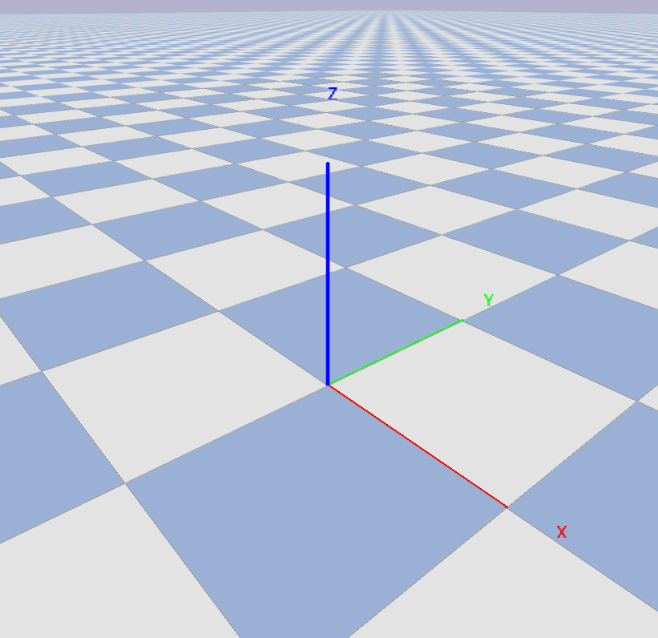

# DEMO 演示流程

### 演示步驟

### （一）生成物件尺寸
1. 生成 觀測作業平台、好工件平台、壞工件平台
    | 名稱 | 尺寸 X(m) | 尺寸 Y(m) | 尺寸 Z(m) |
    | --- | --- | --- | --- |
    | `base_plane` | 0.50 | 0.50 | 0.05 |
    | `good_plane` | 0.50 | 0.50 | 0.05 |
    | `poor_plane` | 0.50 | 0.50 | 0.05 |

2. 生成 機器手臂、爪子（using ***xarm*** robot arm）
    | 名稱 | 尺寸 X(m) | 尺寸 Y(m) | 尺寸 Z(m) |
    | --- | --- | --- | --- |
    | `robot` | --- | --- | --- |
    > pybullet 內建系統預設尺寸

3. 生成 好工件、壞工件
    | 名稱 | 尺寸 X(m) | 尺寸 Y(m) | 尺寸 Z(m) |
    | --- | --- | --- | --- |
    | `good_object` | 0.09 | 0.09 | 0.03 |
    | `poor_object` | 1.00 | 0.09 | 0.03 |

4. 生成 虛擬攝影機
    | 名稱 | 尺寸 X(m) | 尺寸 Y(m) | 尺寸 Z(m) |
    | --- | --- | --- | --- |
    | `camera` | 0.03 | 0.07 | 0.03 |

### （二）固定物件位置
> 原點 `O(0.0, 0.0, 0.0)`

| 名稱 | X(m) | Y(m) | Z(m) |
| --- | --- | --- | --- |
| `base_plane_position` | 0.00 | 0.00 | 0.00 |
| `good_plane_position` | 0.50 | 0.00 | 0.00 |
| `poor_plane_position` | -0.50 | 0.00 | 0.00 |
| `robot_position` | 0.00 | 0.52 | 0.00 |
| `good_object_position` | 0.00 | 0.25 | 0.07 |
| `poor_object_position` | 0.00 | 0.25 | 0.07 |
| `camera_position` | robot+0.05 | robot+0.00 | robot+0.10 |


> 坐標系

### 全域常數設定
> 預設統一單位  

| 統一單位 |  |
| --- | --- |
| 位置 | `[X(m), Y(m), Z(m)]` |
| 尺寸 | `[X(m), Y(m), Z(m)]` |
| 重量 | `kg` |
| 施力 | `N` |
| 時間 | `s` |
| 顏色 | `[R, G, B, A]` |
| 圖像 | `pixel` |
| 關節 | `radian` |
| 角度 | `degree` |

| 名稱 | 型態 | 預設參數 | 意義 |
| --- | --- | --- | --- |
| **模擬環境 pybullet** |  |  |  |
| `GRAVITY` | **float** | -10.00 | 重力加速度，Z軸向下 |
| `UPDATE` | **float** | 1.0 / 1000.0 | pybullet 更新步長，影響模擬精確度與速度 |
| `VIEW` | **list** | --- | pybullet GUI視角參數 |

    # 預設攝影機視角參數 (以場景中心為目標)
    VIEW: List[dict] = [
        {"name": "Default Tilt", "yaw": 45, "pitch": -30, "distance": 1.5},  # 預設傾斜視角，類似您提供的圖片
        {"name": "Top-down (XY)", "yaw": 90, "pitch": -90, "distance": 1.5}, # 垂直俯視 XY 平面
        {"name": "Front (XZ)", "yaw": 90, "pitch": 0, "distance": 1.5},      # 垂直視角，從 X 軸正向看向 XZ 平面
        {"name": "Side (YZ)", "yaw": 0, "pitch": 0, "distance": 1.5},        # 垂直視角，從 Y 軸正向看向 YZ 平面
        {"name": "Back (-XZ)", "yaw": -90, "pitch": 0, "distance": 1.5},     # 垂直視角，從 X 軸負向看向 XZ 平面
        {"name": "Left (-YZ)", "yaw": 180, "pitch": 0, "distance": 1.5}      # 垂直視角，從 Y 軸負向看向 YZ 平面
    ]

| 名稱 | 型態 | 預設參數 | 意義 |
| --- | --- | --- | --- |
| **基準面 plane** |  |  |  |
| `base_plane_size` | **list** | --- | 觀測作業平台尺寸 |
| `base_plane_mass` | **float** | 0 | 觀測作業平台質量 |
| `base_plane_friction_lateral` | **float** | *0.5 | 觀測作業平台摩擦力係數（橫向） |
| `base_plane_friction_spinning` | **float** | *0.16 | 觀測作業平台摩擦力係數（旋轉） |
| `base_plane_friction_rolling` | **float** | *0.025 | 觀測作業平台摩擦力係數（滾動） |
| `base_plane_position` | **list** | --- | 觀測作業平台世界座標系中的位置 |
| `base_plane_color` | **list** | [1, 1, 1, 1] | 觀測作業平台顏色（白色） |
| `good_plane_size` | **list** | --- | 好工件平台尺寸 |
| `good_plane_mass` | **float** | 0 | 好工件平台質量 |
| `good_plane_friction_lateral` | **float** | 8.0 | 好工件平台摩擦力係數（橫向） |
| `good_plane_friction_spinning` | **float** | 2.66 (8.0 / 3) | 好工件平台摩擦力係數（旋轉） |
| `good_plane_friction_rolling` | **float** | 0.4 (8.0 / 20) | 好工件平台摩擦力係數（滾動） |
| `good_plane_position` | **list** | --- | 好工件平台位置 |
| `good_plane_color` | **list** | [0, 1, 0, 1] | 好工件平台顏色（綠色） |
| `poor_plane_size` | **list** | --- | 壞工件平台尺寸 |
| `poor_plane_mass` | **float** | 0 | 壞工件平台質量 |
| `poor_plane_friction_lateral` | **float** | *0.5 | 壞工件平台摩擦力係數（橫向） |
| `poor_plane_friction_spinning` | **float** | *0.16 | 壞工件平台摩擦力係數（旋轉） |
| `poor_plane_friction_rolling` | **float** | *0.025 | 壞工件平台摩擦力係數（滾動） |
| `poor_plane_position` | **list** | --- | 壞工件平台位置 |
| `poor_plane_color` | **list** | [1, 0, 0, 1] | 壞工件平台顏色（紅色） |
| **工件 object** |  |  |  |
| `good_object_size` | **list** | --- | 待偵測物體尺寸 |
| `good_object_mass` | **float** | 0.3 | 待偵測物體質量 |
| `good_object_friction_lateral` | **float** | 5.0 | 待偵測物體摩擦力係數（橫向） |
| `good_object_friction_spinning` | **float** | 1.0 | 待偵測物體摩擦力係數（旋轉） |
| `good_object_friction_rolling` | **float** | 0.05 | 待偵測物體摩擦力係數（滾動） |
| `good_object_position` | **list** | --- | 待偵測物體初始位置 |
| `good_object_color` | **list** | [1, 1, 0, 1] | 待偵測物體顏色（黃色）  |
| `poor_object_size` | **list** | --- | 待偵測物體尺寸 |
| `poor_object_mass` | **float** | 0.3 | 待偵測物體質量 |
| `poor_object_friction_lateral` | **float** | 5.0 | 待偵測物體摩擦力係數 |
| `poor_object_friction_spinning` | **float** | 1.0 | 待偵測物體摩擦力係數（旋轉） |
| `poor_object_friction_rolling` | **float** | 0.05 | 待偵測物體摩擦力係數（滾動） |
| `poor_object_position` | **list** | --- | 待偵測物體初始位置 |
| `poor_object_color` | **list** | [1, 1, 0, 1] | 待偵測物體顏色（黃色） |
| **機器手臂 robot** |  |  |  |
| `robot_urdf_path` | **string** | "xarm/xarm6_with_gripper.urdf" | 機器手臂 URDF 模型路徑 |
| `robot_idle_position` | **list** | [0.0, 0.5, 0.0] | 機器手臂基座在世界座標系中的位置 |
| `robot_grip_open_position` | **int** | 0.85 | 夾爪張開位置 （關節角度） |
| `robot_grip_close_position` | **int** | 0.0 | 夾爪閉合位置 （關節角度） |
| `robot_stable_step` | **int** | 15 | 機器手臂穩定閾值，判斷是否到達目標位置的幀數 |
| `robot_joint_force` | **float** | 250 | 機器手臂關節控制力道 |
| `robot_grip_force` | **float** | 2000 | 夾爪抓取力道 |
| **虛擬攝影機 camera** |  |  |  |
| `camera_size` | **list** | --- | 攝影機視覺化方塊尺寸 |
| `camera_mass` | **float** | 0.01 | 攝影機物體質量 |
| `camera_index` | **int** | 0 | 預設攝影機視角配置的索引 |
| `camera_link_robot_index` | **int** | 6 | 攝影機綁定的機器手臂連桿索引，末端夾爪連桿 |
| `camera_image_width` | **int** | 640 | 攝影機影像寬度 |
| `camera_image_height` | **int** | 480 | 攝影機影像高度 |
| `camera_field_of_view` | **float** | 60 | 攝影機視場角 |
| `camera_aspect_ratio` | **float** | 1.0 | 影像的長寬比 |
| `camera_near_plane` | **float** | 0.01 | 近裁剪面距離 |
| `camera_far_plane` | **float** | 0.5 | --- |
| `camera_offset_position` | **list** | --- | 攝影機相對於機器手臂末端夾爪的偏移位置 |
| `camera_watch_target_position` | **list** | [0.0, 0.0, 0.2] | 攝影機目標點相對於攝影機自身的偏移量 |
| `camera_color` | **list** | [0, 0, 0, 1] | 攝影機視覺化方塊顏色（黑色） |
| **程式狀態 state** |  |  |  |
| `alive` | **bool** | True | pybullet 主執行緒在執行 |
| `mode` | **string** | "monitor" | 終端機程式監控模式 |

### 模擬環境函數設定

### （一）模擬環境初始化
```python
def initialize_environment_simulation(None) -> None:
```  
初始化 PyBullet 模擬環境，設定 GUI 模式、重力、時間步長，並載入預設的平面。

```python
def set_pybullet_camera_view(view_index: int) -> None:
```  
設定 PyBullet 偵錯視窗的攝影機視角。  
- ***Args***
    - `view_index` ***int***：預設攝影機視角配置索引。

### （二）載入模型
```python
def load_box(
        size:               List[float],
        mass:               float = 0.0,
        friction_lateral:   float = 0.0,
        friction_spinning:  float = 0.0,
        friction_rolling:   float = 0.0,
        position:           List[float],
        color:              List[float]
    ) -> int:
```  
建立並載入一個靜態或動態的方塊平台。
- ***Args***
    - `size` ***list***：。
    - `mass` ***float***：。
    - `friction_lateral` ***float***：。
    - `friction_spinning` ***float***：。
    - `friction_rolling` ***float***：。
    - `position` ***list***：。
    - `color` ***list***：。
- ***Returns***
    - `client_id` ***int***：載入的平台物體 ID。

```python
def load_robot(
        initial_joint_radian: List[float],
    ) -> int:
```  
載入機器手臂模型並設定初始關節角度。

```python
def load_camera(
        robot_id: int,
    ) -> int:
```  
建立一個視覺化的方塊來代表攝影機，並將其綁定到機器手臂的指定連桿上。

### （三）機器手臂控制邏輯
```python
def robot_move(
        robot_id:   int,
        target:     List[float],
    ) -> None:
```
機器手臂直接移動。

```python
def robot_move_smoothly(
        robot_id:                       int,
        target:                         List[float],
        max_difference_radian_step:     float,
    ) -> None:
```
機器手臂插植滑順小心移動。

```python
def robot_gripper_open(
        robot_id:   int,
    ) -> None:
```
機器手臂爪子開啟。

```python
def robot_gripper_close(
        robot_id:   int,
    ) -> None:
```
機器手臂爪子關閉。

### （四）機器手臂控制邏輯
```python
def calculate_camera_position(
        camera_id:      int,
        target_offset:  List[float],
    ) -> Tuple[List[float], List[float], List[float]]:
```
根據攝影機物體的位置和姿態，計算其在世界座標系中的位置、目標點和向上向量。
- ***Args***
    - `camera_id` ***int***：攝影機物體 ID。
    - `offset_target` ***list***：攝影機目標點相對於攝影機自身的偏移量。

- ***Returns***
    - `position` ***tuple[list, list, list]***：攝影機位置、目標點、向上向量。

```python
def capture_camera_image(
        camera_position:    List[float],
        target_position:    List[float],
        up_vector:          List[float] = [0, 0, 1]
    ) -> Tuple[np.ndarray, np.ndarray]:
```
從模擬環境中擷取攝影機視角下的 RGB 影像和深度影像。
- ***Args***
    - `camera_position` ***list***：攝影機在世界座標系中的位置。
    - `target_position` ***list***：攝影機注視的目標點在世界座標系中的位置。
    - `up_vector` ***list***：攝影機的向上向量。

- ***Returns***
    - `image` ***tuple[np.ndarray, np.ndarray]***：全彩影像、深度影像。

### （五）及時擷取顯示觀測畫面
```python
def display_capture_image(
        image:              np.ndarray,
        window_title_name:  str = "Real Time Streams of Measurement"
    ) -> None:
```
使用 OpenCV 顯示影像。

### （六）圖像辨識*
```python
def calculate_image_contour(
        image: np.ndarray,
    ) -> float:
```
使用 OpenCV 搭配模型計算圖像邊框，取得邊長。

### （七）終端機畫面
- 模式 `mode`
    - 選單 `selector`
        - ***demo show***  
                
                [INFO]: system running
                [INFO]: state [2]
                ----------選單模式----------
                (1) monitor     監控數據模式
                (2) manual      手動操作模式
                (3) exit        結束主程緒
                ---------------------------

                
                按下 [M] 開啟模式選單
                請輸入模式選擇：
        - ***demo command***  

                [INFO]:（\t）system running
                [INFO]:（\t）state [2]
                ----------選單模式----------（置中此行）
                (1) monitor （\t）監控數據模式
                (2) manual （\t）手動操作模式
                (3) exit （\t）結束主程緒
                （空行）
                （空行）
                按下 [M] 開啟模式選單
                請輸入模式選擇：

    - 監控數據模式 `monitor`
        - ***demo show***  

                [INFO]: system running
                [INFO]: state [2]
                ---------------------------------監控模式---------------------------------
                ----------機器手臂 關節弧度----------    ---------待測工件---------    ---------預設工件---------
                [01: -1.57 rad]    [09:  0.85 rad]     測量長度： 0.08 m             預設長度： 0.09 m 
                [02: -0.10 rad]    [12:  0.85 rad]     測量寬度： 0.08 m             預設寬度： 0.09 m
                [03: -1.20 rad]    [10:  0.00 rad]     測量高度： 0.03 m             預設高度： 0.05 m
                [05:  1.30 rad]    [13:  0.00 rad]     測量狀態： 正常                預設狀態： 正常
                                                       測量座標： [0, -0.01, 0]      預設座標： [0, -0.01, 0]

                預設執行路徑：[1]初始化 -> [2]觀測工件XY面 -> [3]觀測工件XZ面 -> [4]觀測工件YZ面 -> [5]移動到合適的平台 
                [目前進度]：路徑[2]
                [目前狀態]：觀測正常


                按下 [M] 開啟模式選單
                請輸入模式選擇：
        - ***demo command***  

                [INFO]:（\t）system running
                [INFO]:（\t）state [2]
                ---------------------------------監控模式---------------------------------（置中此行）
                ----------機器手臂 關節弧度----------（\t）---------待測工件---------（\t）---------預設工件---------
                [01: -1.57 rad]（\t）[09:  0.85 rad]（\t）測量長度： 0.08 m（\t）（\t）預設長度： 0.09 m 
                [02: -0.10 rad]（\t）[12:  0.85 rad]（\t）測量寬度： 0.08 m（\t）（\t）預設寬度： 0.09 m
                [03: -1.20 rad]（\t）[10:  0.00 rad]（\t）測量高度： 0.03 m（\t）（\t）預設高度： 0.05 m
                [05:  1.30 rad]（\t）[13:  0.00 rad]（\t）測量狀態： 正常（\t）（\t）預設狀態： 正常
                （\t）（\t）（\t）（\t）測量座標： [0, -0.01, 0]（\t）（\t）預設座標： [0, -0.01, 0]
                （空行）
                預設執行路徑：[1]初始化 -> [2]觀測工件XY面 -> [3]觀測工件XZ面 -> [4]觀測工件YZ面 -> [5]移動到合適的平台 
                [目前進度]：路徑[2]
                [目前狀態]：觀測正常
                （空行）
                （空行）
                按下 [M] 開啟模式選單
                請輸入模式選擇：
    - 手動操作模式 `manual`
        - ***demo1 show***  

                [INFO]: system running
                [INFO]: state [2]
                ---------------------------------手動模式---------------------------------
                ----------機器手臂 關節弧度----------
                [00]: -1.57 rad    [04]: -1.57 rad    [08]: -1.57 rad    [12]: -1.57 rad
                [01]: -1.57 rad    [05]: -1.57 rad    [09]: -1.57 rad    [13]: -1.57 rad
                [02]: -1.57 rad    [06]: -1.57 rad    [10]: -1.57 rad
                [03]: -1.57 rad    [07]: -1.57 rad    [11]: -1.57 rad

                
                按下 [M] 開啟模式選單
                按下 [H] 開啟手動選單
                請輸入模式選擇：
        - ***demo2 show***  

                [INFO]: system running
                [INFO]: state [2]
                ---------------------------------手動模式---------------------------------
                ----------機器手臂 指令說明----------
                
                F1: 給座標，讓機器手臂自己計算到該座標的弧度。
                C1: 給定<(x, y, z)>，代入你要的目標座標值。
                ---------
                (x, y, z)
                ---------

                F2: 給指定關節與弧度，讓機器手臂依據移動。
                C2: 給定<指定關節 弧度>
                ----
                5 10
                ----

                
                [提示]：請在 [手動選單] 底下 [請輸入模式選擇] 輸入 <5 10> or <(0, 1, 2)>，就可以移動了。
                [提示]：建議在 [手動選單] -> [機器手臂 關節弧度] 頁面操作
                
                按下 [M] 開啟模式選單
                按下 [Q] 返回上一頁
                請輸入模式選擇：
        - ***demo1 command***  

                [INFO]:（\t）system running
                [INFO]:（\t）state [2]
                ---------------------------------手動模式---------------------------------（置中此行）
                ----------機器手臂 關節弧度----------（置中此行）
                [00]: -1.57 rad（\t）[04]: -1.57 rad（\t）[08]: -1.57 rad（\t）[12]: -1.57 rad
                [01]: -1.57 rad（\t）[05]: -1.57 rad（\t）[09]: -1.57 rad（\t）[13]: -1.57 rad
                [02]: -1.57 rad（\t）[06]: -1.57 rad（\t）[10]: -1.57 rad
                [03]: -1.57 rad（\t）[07]: -1.57 rad（\t）[11]: -1.57 rad

                
                按下 [M] 開啟模式選單
                按下 [H] 開啟手動選單
                請輸入模式選擇：
        - ***demo2 command***  

                [INFO]:（\t）system running
                [INFO]:（\t）state [2]
                ---------------------------------手動模式---------------------------------（置中此行）
                ----------機器手臂 指令說明----------（置中此行）
                
                F1: 給座標，讓機器手臂自己計算到該座標的弧度。
                C1: 給定<(x, y, z)>，代入你要的目標座標值。
                ---------
                (x, y, z)
                ---------

                F2: 給指定關節與弧度，讓機器手臂依據移動。
                C2: 給定<指定關節 弧度>
                ----
                5 10
                ----

                
                [提示]：請在 [手動選單] 底下 [請輸入模式選擇] 輸入 <5 10> or <(0, 1, 2)>，就可以移動了。
                [提示]：建議在 [手動選單] -> [機器手臂 關節弧度] 頁面操作
                
                按下 [M] 開啟模式選單
                按下 [Q] 返回上一頁
                請輸入模式選擇：

### （八）公用程式
```python
def terminal_clear_screen(None) -> None:
```
清除終端機畫面，兼容 Windows 和類 Unix (Linux/macOS) 系統。

```python
def trajectory_smoothly(
        trajectory_data:    List[List[float]],
        difference_step:    int = 15
    ) -> List[List[float]]:
```
對整個關節路徑序列進行線性插值，使機器手臂移動更平滑。  
適用路徑都是目的地沒有人為差值的情況下做自動插值。

### （九）主執行緒

```python
if __name__ == "__main__":

    # 初始化
    # 設定攝影機視角

    # 創建 base_plane
    # 創建 good_plane
    # 創建 poor_plane
    # 創建 robot
    # 創建 camera + 綁定

    # 獲取 robot 關節數量跟弧度
    # 啟動一個異步線程給輸入
    
    # 設定固定抓取路徑
    # 設定 好 or 壞 工件
    # 設定終端機模式，預設監控
    
    while alive:
        '''
            主執行緒
            pybullet 模擬環境
            
            1. 獲取機器手臂關節弧度更新
            2. 獲取物體座標更新
            3. 獲取機器手臂座標更新
            4. 獲取攝影機座標更新
            5. 獲取目前路徑狀態
        '''

        '''
            跑流程
            1. 路徑是否經過人為平順 ? 自動平順化路徑 : 使用插入間隔函數
            2. (迴圈A) 滑順移動到目標點 + 等待移動誤差
            3. (迴圈A) 判斷目標點是觀測工件哪一面 + 在這裡等待 + 圖像辨識取得長度 + 紀錄本次長寬
            3. (迴圈A) 移動到合適的平台 ? + 判斷計算好誤差是否符合預設工件期待 + 好 ? 移動到好平台 : 壞 ? 移動到壞平台
        '''

        # 如果在 GUI 按下 I 切換 pybullet 攝影機視角
        # 如果在 GUI 按下 Q 設定 alive = False
        # 顯示終端機

        p.removeAllUserDebugItems()
        p.stepSimulation()
        time.sleep(UPDATE)
```

### 流程
### （一）初始化 
### （二）觀測工件XY面
### （三）觀測工件XZ面 
### （四）觀測工件YZ面 
### （五）移動到合適的平台 
